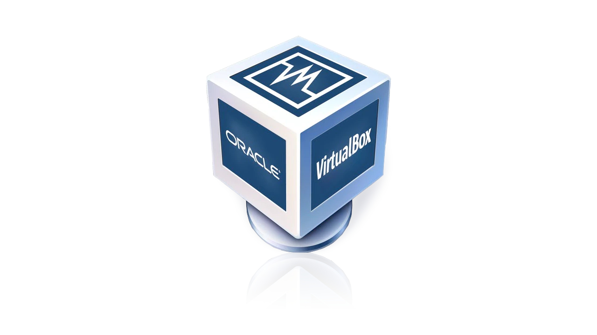

# Preparação em Ambiente
### Vamos preparar o ambiente para Desenvolvimento de aplicações

#### Neste ambiente iremos instalar e configurar os seguintes recursos: 
- Maquina Virtual(Virtualbox)
- Distribuição Linux(Ubuntu Server)
- Nasm
- Compilador da liguagem C
- Configurar o ip e a porta de de comunicação entre a maquina real e a virtual
- Configuração o acesso via SSH entre o VSCode e o ServidorLinux
- Instalar as extensões: Material Icon, Nasm, SSH e Liguagem C/C++

#### Maquina Virtual(Virtualbox)

Maquina Virtual é uma ferramenta que permite a criação de novos "computadores" e a instalação de sistemas operacionais, para estudo ou trabalho.

para o nosso estudo iremos usar o VirtualBox, da Oracle.
para instalar, basta fazer o download no link a seguir:

<a href="https://www.virtualbox.org/wiki/Downloads" target="_blank">VirtualBox </a>

##### Criando a maquina virtual para o nosso estuddo

- Configuração:
    > - Nome da maquina: Servidor
    > - Memória: 4GB(4096)
    > - Processador: 2
    > - Disco: 100GB
    > - IP e Porta do host: 127.0.0.1 e 22
    > - IP e Porta do Convidado: 10.0.2.15 e 22

- Tela inicial de configuração 

- Tela configuração do Hardware

- Tela de configuração do Disco

- Tela final configuração

- Tela  inicial de configuração

- Tela de configuração de Portas e IP

#### Distruibuição Ubuntu server

Para o nosso estudo iremos utilizar uma distribuição Linux para servidores chamada Ubuntu.
Acompanhe o processo de instalação

Faça o download aqui:
<a href="https://ubuntu.com/download/server" target="_blank"> Ubuntu Server </a>

- Acompanhe a instalação

- Tela de inicio de instalação

- Tela de seleção de idioma 

- Tela de seleção

- Tela de tipo de instalação

- Tela configuração de rede

- Tela configuração do proxy 

- Tela pacotes de atualização

- Tela configuração do disco

- Tela layout do disco

- Tela configuração do usuario 

- Tela configuração do SSH

- Tela do fim da instalação

